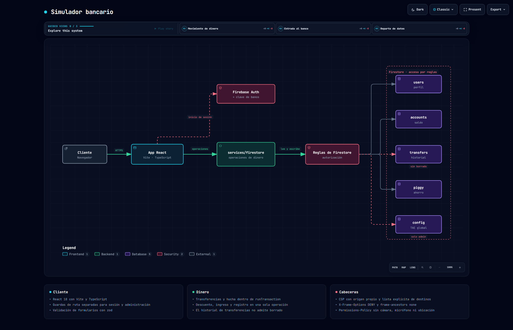

# Banquinter

Simulador de banca en línea: cuentas con saldo, transferencias entre clientes, hucha de ahorro con
TAE, historial de movimientos y panel de administración.

React 18 · Vite · TypeScript · Cloud Firestore



> Diagrama generado con [Archify](https://github.com/tt-a1i/archify) a partir del código de este
> repositorio. Especificación en [`docs/arquitectura.architecture.json`](docs/arquitectura.architecture.json);
> versión navegable en [`docs/arquitectura.html`](docs/arquitectura.html).

---

## El problema interesante: mover dinero sin perderlo

Una transferencia son tres escrituras que tienen que ocurrir juntas o no ocurrir: restar del
origen, sumar al destino y dejar constancia. Si se hacen sueltas y algo falla en medio, el dinero
desaparece o se duplica.

Por eso todas las operaciones de dinero en
[`src/services/firestore.ts`](src/services/firestore.ts) van dentro de `runTransaction`:

```ts
export async function transfer(fromUid: string, toUid: string, amount: number, note?: string) {
  await runTransaction(db, async (tx) => {
    // lee los dos saldos, comprueba fondos,
    // escribe origen, destino y el registro de la transferencia
  })
}
```

Firestore lee dentro de la transacción, y si algún documento cambió entre la lectura y la
escritura, reintenta la función entera. Lo mismo se aplica a los ingresos y las retiradas de la
hucha.

## Acceso

Dos pasos propios: la contraseña de Firebase Auth y una **clave de banco** adicional, guardada
como hash en el documento del usuario y comprobada al entrar.

```
src/security/
├── constantTime.ts    comparación sin cortar al primer byte distinto
└── rateLimiter.ts     5 intentos por minuto, con espera creciente hasta 15 min
```

Conviene decir qué son y qué no son estas dos piezas: **ambas se ejecutan en el navegador**. El
limitador vive en `localStorage`, así que frena a un usuario que se equivoca de contraseña pero no
a quien quiera saltárselo. La defensa real contra la fuerza bruta es la del proveedor de
identidad; esto es la primera barrera, no la única.

## Cabeceras

[`public/_headers`](public/_headers) define la política que sirve Netlify:

| Cabecera | Valor |
|---|---|
| `Content-Security-Policy` | Origen propio más una lista explícita de destinos de Google |
| `X-Frame-Options` | `DENY`, y `frame-ancestors 'none'` en la CSP |
| `Referrer-Policy` | `no-referrer` |
| `X-Content-Type-Options` | `nosniff` |
| `Permissions-Policy` | Sin cámara, micrófono ni ubicación |

## Reglas de Firestore

| Colección | Contenido |
|---|---|
| `users` | Perfil, rol y hash de la clave de banco |
| `accounts` | Número de cuenta, saldo y bloqueo |
| `transfers` | Historial de movimientos |
| `piggy` | Hucha de ahorro |
| `emailToUid` | Índice para transferir por correo |
| `config/global` | TAE aplicada al ahorro |

El historial es lo único cerrado del todo: **una transferencia no se puede borrar nunca**, ni
siquiera desde una cuenta de administrador.

```js
match /transfers/{id} {
  allow read: if isSignedIn();
  allow create: if isSignedIn();
  allow delete: if false;
}
```

## Estructura

```
src/
├── App.tsx
├── firebase.ts
├── components/
│   ├── AuthGuard.tsx        exige sesión
│   ├── AdminGuard.tsx       exige rol de administrador
│   └── NavBar.tsx  Logo.tsx
├── pages/
│   ├── Home.tsx  Login.tsx  Register.tsx
│   ├── Dashboard.tsx        saldo y accesos rápidos
│   ├── History.tsx          movimientos
│   ├── PiggyBank.tsx        ahorro
│   ├── Investments.tsx      simulación de TAE
│   ├── Profile.tsx  Settings.tsx  Info.tsx
│   └── Admin.tsx            gestión de clientes
├── services/firestore.ts    todas las operaciones de dinero
├── security/                comparación y limitador
└── state/                   sesión e idioma
```

## Puesta en marcha

```bash
npm install
npm run dev
```

Necesita un proyecto de Firebase con Authentication y Firestore, y desplegar
[`firestore.rules`](firestore.rules).

## Estado

**Es un simulador, no un banco.** No mueve dinero real ni se conecta a ninguna entidad: está hecho
para practicar el problema de la consistencia en las escrituras y el reparto de permisos.
